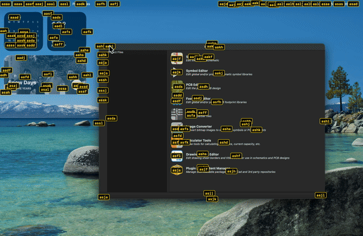
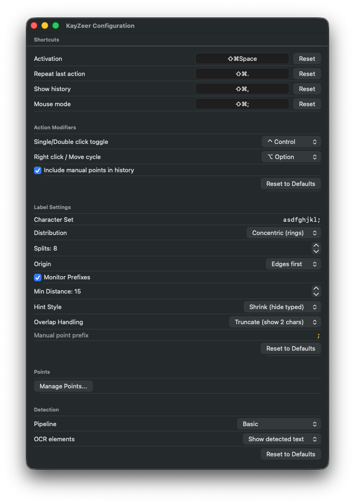

# KayZeer

Keyboard-driven screen navigation for macOS. Click anything without touching the mouse.

KayZeer detects interactive UI elements on your screen and overlays hint labels on each one. Type the letters to click — like Vimium, but for your entire desktop.

<!-- TODO: Add a demo GIF here

-->

## Download

Get the latest release from the [Releases page](https://github.com/serjster/KayZeer/releases).

1. Download the `.dmg` file
2. Open it and drag **KayZeer** to Applications
3. Launch KayZeer — it lives in your menu bar (no Dock icon)
4. Grant **Accessibility** and **Screen Recording** permissions when prompted

## How to Use

1. Press `Ctrl + Shift + Space` to activate
2. Hint labels appear on every detected UI element
3. Type the hint letters to click that element
4. Press `Escape` to cancel, `Backspace` to correct

### Configuration

Click the menu bar icon and select **Configure...** to customize:

| Setting             | Description                                                             | Default            |
|---------------------|-------------------------------------------------------------------------|--------------------|
| Activation shortcut | Key combo to trigger hints                                              | `Ctrl+Shift+Space` |
| Character set       | Characters used for hint labels                                         | `asdfjkl;`         |
| Distribution        | How labels are spatially assigned (Linear, Random, Hilbert, Grid, etc.) | Linear             |
| Monitor Prefixes    | First character selects a monitor, rest select within it                | On                 |
| Hint Style          | Shrink (hide typed chars) or Gray out (dim typed chars)                 | Shrink             |

### Manual Click Points

You can add persistent click points via **Manage Points** in the configuration window. These are always available alongside auto-detected elements and use the last character in your character set as a prefix.

## Requirements

- macOS 14 (Sonoma) or later
- Accessibility permission (for keyboard monitoring and click simulation)
- Screen Recording permission (for UI element detection)

## Changelog

See [CHANGELOG.md](CHANGELOG.md) for release history.

## License

KayZeer is free to use. See [LICENSE](LICENSE) for details.

## Contact

- Blog: [serjster.com](https://www.serjster.com)
- GitHub Issues: [Report a bug or request a feature](https://github.com/serjster/KayZeer/issues)
